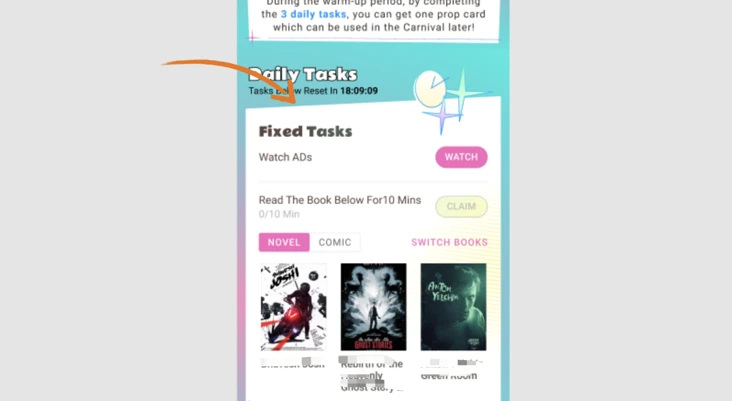
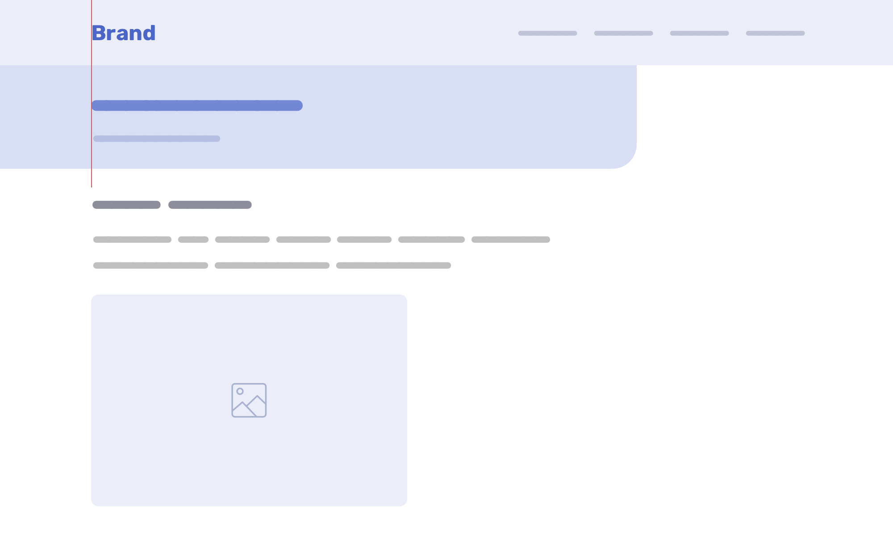

### CSS: 实现切角效果

https://segmentfault.com/a/1190000041715976

### CSS: 实现不同容器中的内容对齐

https://ishadeed.com/article/aligning-content-different-wrappers/

### 工具: 10 Front End Developers Tools

https://realjema.medium.com/10-front-end-developers-tools-4130f50fe0fe
