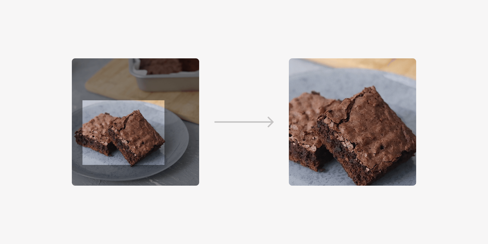

### State of CSS 2022

2022 CSS 新特性

https://web.dev/state-of-css-2022/

### CSS: First Look At The CSS object-view-box Property

https://ishadeed.com/article/css-object-view-box/

### AbortController is your friend

https://whistlr.info/2022/abortcontroller-is-your-friend/

### Tools: use-clamp-text

`clamp text` `文本超出隐藏`

https://github.com/drenther/use-clamp-text

### Tools: node-website-scraper

`爬虫`

https://github.com/website-scraper/node-website-scraper

### Tools: js-fire

`命令行` `js object to cli`

https://github.com/hobochild/js-fire

### Tools: moon

`项目管理` `构建系统`

https://moonrepo.dev/

### Tools: public-ip

`ip` `get public ip`

https://github.com/sindresorhus/public-ip
